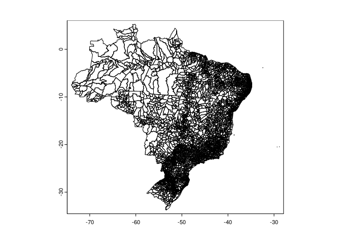
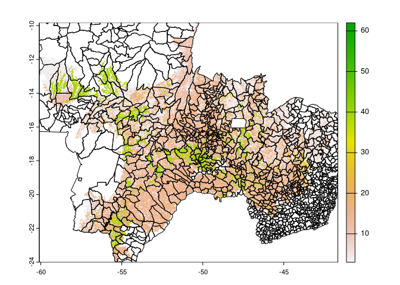
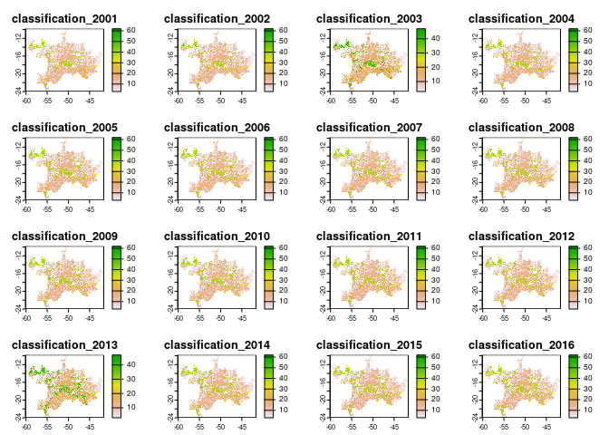
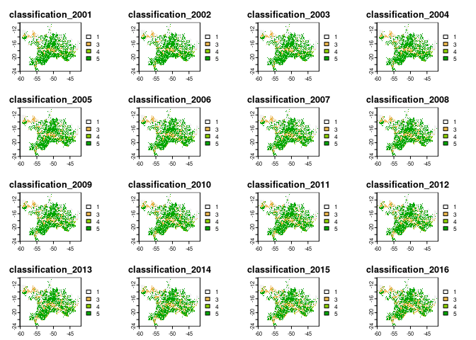

Cerrado Land Cover Input
================
James D.A. Millington
July 2022

``` r
library(terra)
```

    ## terra 1.5.34

``` r
library(readxl)
```

This document presents a record of analysis to create land cover inputs
to an application of CRAFTY to Cerrado biome in four states (GO, MT, MS,
MG).

[MapBiomas](https://mapbiomas.org/en) Collection 6 Land Cover raster
(.tif) files were downloaded for 2001-2020 for the Cerrado biome via the
Toolkits in Google Earth Engine. Spatial resolution was changed from
from 30m to 1000m in the run dialogue. Outputs had naming convention
*mapbiomas-brazil-collection-60-cerrado-YYYY-1km.tif* where *YYYY* is
four digit year.

Because we can download mapbiomas data at our desired resolution
(whereas previously only 30m was available), we will take a different
approach to develop the input region file for CRAFTY [than used for
CRAFTY Brazil](https://github.com/jamesdamillington/BrazilInputMaps).
Rather than creating the BaseRaster first from a rasterised vector,
we’ll use the mapbiomas raster as a base and work from there.

So, first. combine the mapbiomas raster files into a single multi-layer
raster and set `0` values to `No Data`

``` r
r <- rast("data/mapbiomas6/mapbiomas-brazil-collection-60-cerrado-2001-1km.tif")
for(i in 2002:2020){
  r1 <- rast(paste0("data/mapbiomas6/mapbiomas-brazil-collection-60-cerrado-",i,"-1km.tif"))
  r <- c(r, r1)
}
r[r==0] <- NA
r
```

    ## class       : SpatRaster 
    ## dimensions  : 2489, 2138, 20  (nrow, ncol, nlyr)
    ## resolution  : 0.008983153, 0.008983153  (x, y)
    ## extent      : -60.47944, -41.27346, -24.68777, -2.328703  (xmin, xmax, ymin, ymax)
    ## coord. ref. : lon/lat WGS 84 (EPSG:4326) 
    ## source      : spat_YDwoRatykQ6n51D_23166.tif 
    ## names       : class~_2001, class~_2002, class~_2003, class~_2004, class~_2005, class~_2006, ... 
    ## min values  :           3,           3,           3,           3,           3,           3, ... 
    ## max values  :          48,          48,          48,          48,          48,          48, ...

``` r
plot(r[[1]])
```

<!-- -->

This multi-layer raster needs to be clipped to the extent of our four
states of interest.

We do this using municiaplity and state boundary vector (.shp) data

``` r
munis <- vect("data/vector/BRadmin.shp")
plot(munis)
```

<!-- -->

``` r
head(munis)
```

    ##                   NM_MUNICIP CD_GEOCMU CD_GEOCMUn State NM_ESTADO NM_REGIAO
    ## 1                      CAIUÁ   3509106    3509106    35 SÃO PAULO   SUDESTE
    ## 2                   CASTILHO   3511003    3511003    35 SÃO PAULO   SUDESTE
    ## 3                    DRACENA   3514403    3514403    35 SÃO PAULO   SUDESTE
    ## 4           ESTRELA DO NORTE   3515301    3515301    35 SÃO PAULO   SUDESTE
    ## 5 EUCLIDES DA CUNHA PAULISTA   3515350    3515350    35 SÃO PAULO   SUDESTE
    ## 6            MARABÁ PAULISTA   3528700    3528700    35 SÃO PAULO   SUDESTE
    ##   CD_GEOCUF
    ## 1        35
    ## 2        35
    ## 3        35
    ## 4        35
    ## 5        35
    ## 6        35

We can see state ids and state names. States ids for our states are 50,
51, 52, 31

The accents on some state names are not being handled well (giving
errors/warnings). We’ll fix this below before writing out our subset
shapefile containing only the four states we want.

``` r
#state ids in id column
sids <- c(50, 51, 52, 31)

#subset
G3MGs <- munis[munis$State %in% sids,]
plot(G3MGs)
```

<!-- -->

``` r
head(G3MGs)
```

    ##     NM_MUNICIP CD_GEOCMU CD_GEOCMUn State          NM_ESTADO    NM_REGIAO
    ## 1   ÁGUA CLARA   5000203    5000203    50 MATO GROSSO DO SUL CENTRO-OESTE
    ## 2  ALCINÓPOLIS   5000252    5000252    50 MATO GROSSO DO SUL CENTRO-OESTE
    ## 3      AMAMBAI   5000609    5000609    50 MATO GROSSO DO SUL CENTRO-OESTE
    ## 4    ANASTÁCIO   5000708    5000708    50 MATO GROSSO DO SUL CENTRO-OESTE
    ## 5 ANAURILÂNDIA   5000807    5000807    50 MATO GROSSO DO SUL CENTRO-OESTE
    ## 6     ANGÉLICA   5000856    5000856    50 MATO GROSSO DO SUL CENTRO-OESTE
    ##   CD_GEOCUF
    ## 1        50
    ## 2        50
    ## 3        50
    ## 4        50
    ## 5        50
    ## 6        50

``` r
#fix GOIAS name
#G3MGs[1,'name'] <- "GOIAS"
#head(G3MGs)

#write to file
outfile <- "data/vector/G3MGs.shp"
writeVector(G3MGs, outfile, overwrite=TRUE)
```

Read in our subset shapefile and re-project to the CRS of our raster
data ready for clipping.

``` r
s4<- vect("data/vector/G3MGs.shp")
crsr <- crs(r)
s4 <- terra::project(s4, crsr)
```

Plot one raster layer with the re-projected vector data to check

``` r
plot(r[[1]])
plot(s4, add=T)
```

<!-- -->

Now clip (crop, mask, trim) the raster data by the re-projected
four-state vector (plot one layer to check)

``` r
rs4 <- crop(r , ext(s4)) 
rs4 <- mask(rs4, s4)
rs4 <- trim(rs4)
rs4
```

    ## class       : SpatRaster 
    ## dimensions  : 1578, 2052, 20  (nrow, ncol, nlyr)
    ## resolution  : 0.008983153, 0.008983153  (x, y)
    ## extent      : -60.09316, -41.65973, -24.00505, -9.829635  (xmin, xmax, ymin, ymax)
    ## coord. ref. : lon/lat WGS 84 (EPSG:4326) 
    ## source      : spat_19sMmjisJrq2lgs_23166.tif 
    ## names       : class~_2001, class~_2002, class~_2003, class~_2004, class~_2005, class~_2006, ... 
    ## min values  :           3,           3,           3,           3,           3,           3, ... 
    ## max values  :          48,          48,          48,          48,          48,          48, ...

``` r
plot(rs4[[1]])
plot(s4, add=T)
```

<!-- -->

Write multi-layer raster to .tif file

``` r
writeRaster(rs4, "data/mapbiomas6/mapbiomas6-cerrado-G3MGs-2001-2020-1km.tif", overwrite=TRUE)
```

Re-load and plot to check this all worked.

``` r
new <- rast("data/mapbiomas6/mapbiomas6-cerrado-G3MGs-2001-2020-1km.tif")
new
```

    ## class       : SpatRaster 
    ## dimensions  : 1578, 2052, 20  (nrow, ncol, nlyr)
    ## resolution  : 0.008983153, 0.008983153  (x, y)
    ## extent      : -60.09316, -41.65973, -24.00505, -9.829635  (xmin, xmax, ymin, ymax)
    ## coord. ref. : lon/lat WGS 84 (EPSG:4326) 
    ## source      : mapbiomas6-cerrado-G3MGs-2001-2020-1km.tif 
    ## names       : class~_2001, class~_2002, class~_2003, class~_2004, class~_2005, class~_2006, ... 
    ## min values  :           3,           3,           3,           3,           3,           3, ... 
    ## max values  :          48,          48,          48,          48,          48,          48, ...

``` r
plot(new)
```

<!-- -->

Now reclassify (no need for disaggregation like for CRAFTY-Brazil,
because collection 6 include classes for soybeans etc)

``` r
classification <- read_excel(paste0("data/mapbiomas6/MapBiomas_CRAFTY_classifications_v6.xlsx"), sheet = 'Mapbiomas6', range="G1:H35", col_names=T)  
map <- classify(new, rcl=as.matrix(classification))                 #classify
plot(map)
```

<!-- -->
