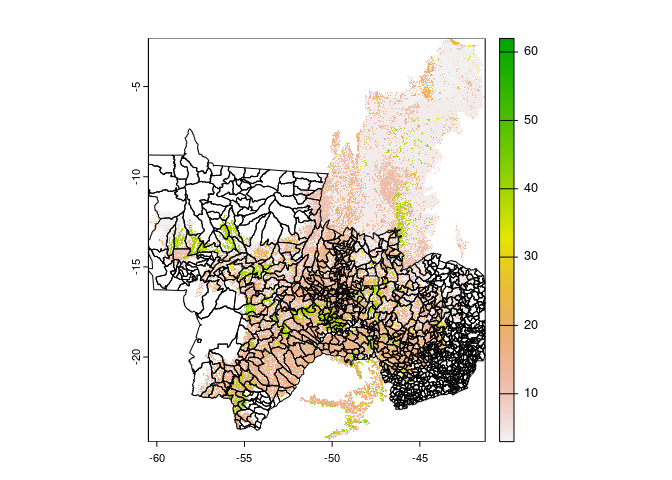

Cerrado Land Cover Input
================
James D.A. Millington
July 2022

``` r
library(terra)
```

    ## terra 1.5.34

This document presents a record of analysis to create land cover inputs
to an application of CRAFTY to Cerrado biome in four states (GO, MT, MS,
MG).

[MapBiomas](https://mapbiomas.org/en) Collection 6 Land Cover raster
(.tif) files were downloaded for 2001-2020 for the Cerrado biome via the
Toolkits in Google Earth Engine. Spatial resolution was changed from
from 30m to 1000m in the run dialogue. Outputs had naming convention
*mapbiomas-brazil-collection-60-cerrado-YYYY-1km.tif* where *YYYY* is
four digit year.

Combine these raster files into a single multi-layer raster and set `0`
values to `No Data`

``` r
r <- rast("data/mapbiomas6/mapbiomas-brazil-collection-60-cerrado-2001-1km.tif")
for(i in 2002:2020){
  r1 <- rast(paste0("data/mapbiomas6/mapbiomas-brazil-collection-60-cerrado-",i,"-1km.tif"))
  r <- c(r, r1)
}
r[r==0] <- NA
r
```

    ## class       : SpatRaster 
    ## dimensions  : 2489, 2138, 20  (nrow, ncol, nlyr)
    ## resolution  : 0.008983153, 0.008983153  (x, y)
    ## extent      : -60.47944, -41.27346, -24.68777, -2.328703  (xmin, xmax, ymin, ymax)
    ## coord. ref. : lon/lat WGS 84 (EPSG:4326) 
    ## source      : spat_rKKGaDknClZW3hp_68787.tif 
    ## names       : class~_2001, class~_2002, class~_2003, class~_2004, class~_2005, class~_2006, ... 
    ## min values  :           3,           3,           3,           3,           3,           3, ... 
    ## max values  :          48,          48,          48,          48,          48,          48, ...

``` r
plot(r[[1]])
```

<!-- -->

This multi-layer raster needs to be clipped to the extent of our four
states of interest.

We do this using state boundary vector (.shp) data downloaded from the
[MapBiomas Platform](https://plataforma.brasil.mapbiomas.org/) (Source:
IBGE; Year: 2018).

``` r
s <- vect("data/vector/dashboard_states-static-layer/dashboard_states-static-layer.shp")
plot(s)
```

<!-- -->

``` r
head(s)
```

    ##      id version           name source inserted_a updated_at category category_n
    ## 1 18348       1        SERGIPE   IBGE 2020/02/07 2020/02/07    state     Estado
    ## 2 18349       1    MARANH\xc3O   IBGE 2020/02/07 2020/02/07    state     Estado
    ## 3 18359       1 ESPIRITO SANTO   IBGE 2020/02/07 2020/02/07    state     Estado
    ## 4 18367       1       AMAZONAS   IBGE 2020/02/07 2020/02/07    state     Estado
    ## 5 18368       1        RORAIMA   IBGE 2020/02/07 2020/02/07    state     Estado
    ## 6 18369       1       GOI\xc1S   IBGE 2020/02/07 2020/02/07    state     Estado
    ##     area_ha
    ## 1   2192707
    ## 2  32964450
    ## 3   4607477
    ## 4 155917911
    ## 5  22427541
    ## 6  34012812

We can see state ids and state names. States ids for our states are
`18369`, `18396`, `18397`, `18399`

The accents on some state names are not being handled well (giving
errors/warnings). We’ll fix this below before writing out our subset
shapefile containing only the four states we want.

``` r
#state ids in id column
sids <- c(18369, 18396, 18397, 18399)

#subset
G3MGs <- s[s$id %in% sids,]
plot(G3MGs)
```

<!-- -->

``` r
head(G3MGs)
```

    ##      id version               name source inserted_a updated_at category
    ## 1 18369       1           GOI\xc1S   IBGE 2020/02/07 2020/02/07    state
    ## 2 18396       1 MATO GROSSO DO SUL   IBGE 2020/02/07 2020/02/07    state
    ## 3 18397       1        MATO GROSSO   IBGE 2020/02/07 2020/02/07    state
    ## 4 18399       1       MINAS GERAIS   IBGE 2020/02/07 2020/02/07    state
    ##   category_n  area_ha
    ## 1     Estado 34012812
    ## 2     Estado 35714807
    ## 3     Estado 90321339
    ## 4     Estado 58652527

``` r
#fix GOIAS name
G3MGs[1,'name'] <- "GOIAS"
head(G3MGs)
```

    ##      id version               name source inserted_a updated_at category
    ## 1 18369       1              GOIAS   IBGE 2020/02/07 2020/02/07    state
    ## 2 18396       1 MATO GROSSO DO SUL   IBGE 2020/02/07 2020/02/07    state
    ## 3 18397       1        MATO GROSSO   IBGE 2020/02/07 2020/02/07    state
    ## 4 18399       1       MINAS GERAIS   IBGE 2020/02/07 2020/02/07    state
    ##   category_n  area_ha
    ## 1     Estado 34012812
    ## 2     Estado 35714807
    ## 3     Estado 90321339
    ## 4     Estado 58652527

``` r
#write to file
outfile <- "data/vector/G3MGs.shp"
writeVector(G3MGs, outfile, overwrite=TRUE)
```

Read in our subset shapefile and re-project to the CRS of our raster
data ready for clipping.

``` r
s4<- vect("data/vector/G3MGs.shp")
crsr <- crs(r)
s4 <- terra::project(s4, crsr)
```

Plot one raster layer with the re-projected vector data to check

``` r
plot(r[[1]])
plot(s4, add=T)
```

<!-- -->

Now clip (crop, mask, trim) the raster data by the re-projected
four-state vector (plot one layer to check)

``` r
rs4 <- crop(r , ext(s4)) 
rs4 <- mask(rs4, s4)
rs4 <- trim(rs4)
rs4
```

    ## class       : SpatRaster 
    ## dimensions  : 1578, 2052, 20  (nrow, ncol, nlyr)
    ## resolution  : 0.008983153, 0.008983153  (x, y)
    ## extent      : -60.09316, -41.65973, -24.00505, -9.829635  (xmin, xmax, ymin, ymax)
    ## coord. ref. : lon/lat WGS 84 (EPSG:4326) 
    ## source      : memory 
    ## names       : class~_2001, class~_2002, class~_2003, class~_2004, class~_2005, class~_2006, ... 
    ## min values  :           3,           3,           3,           3,           3,           3, ... 
    ## max values  :          48,          48,          48,          48,          48,          48, ...

``` r
plot(rs4[[1]])
```

<!-- -->

Write multi-layer raster to .tif file

``` r
writeRaster(rs4, "data/mapbiomas6/mapbiomas6-cerrado-G3MGs-2001-2020-1km.tif", overwrite=TRUE)
```

Re-load and plot to check this all worked.

``` r
new <- rast("data/mapbiomas6/mapbiomas6-cerrado-G3MGs-2001-2020-1km.tif")
new
```

    ## class       : SpatRaster 
    ## dimensions  : 1578, 2052, 20  (nrow, ncol, nlyr)
    ## resolution  : 0.008983153, 0.008983153  (x, y)
    ## extent      : -60.09316, -41.65973, -24.00505, -9.829635  (xmin, xmax, ymin, ymax)
    ## coord. ref. : lon/lat WGS 84 (EPSG:4326) 
    ## source      : mapbiomas6-cerrado-G3MGs-2001-2020-1km.tif 
    ## names       : class~_2001, class~_2002, class~_2003, class~_2004, class~_2005, class~_2006, ... 
    ## min values  :           3,           3,           3,           3,           3,           3, ... 
    ## max values  :          48,          48,          48,          48,          48,          48, ...

``` r
plot(new)
```

<!-- -->
